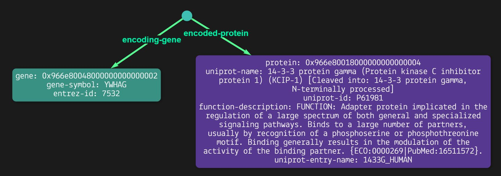
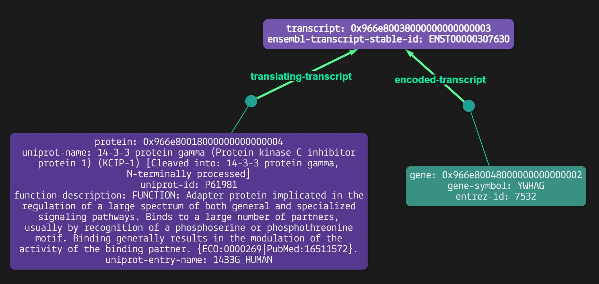

# Biomedical-knowledge-graph -- TypeDB (Uniprot example)
This is a summer remote project (extended to term-time) by Kin Chao (kwc20@ic.ac.uk, a second year Chemistry student at Imperial College), supervised by Dr Sarah Rouse (s.rouse@imperial.ac.uk, Life Science Department, Imperial College). Some of the codes are forked from [BioGrakn Covid](https://github.com/vaticle/typedb-data-bio-covid).

## Latest update 24/10/2021 - Complete integration of the Uniprot dataset

## Installation guide
**Prerequesites**: Python >3.6, [TypeDB Core 2.4.0](https://vaticle.com/download#core), [TypeDB Python Client API 2.2.0](https://docs.vaticle.com/docs/client-api/python), [Workbase 2.4.0](https://vaticle.com/download#workbase) (typeDB Studio).

Clone this repo:
```bash 
    https://github.com/KinChao/Biomedical-knowledge-graph.git
```
cd into the typedb-all folder and start typedb
```bash 
   typedb server
```
cd into the project folder and start the migrator script

```bash
    python migrator.py -n 4 # insert using 4 threads
```
If the database already existed, use the following code instead

```bash
    python migrator.py -n 4 -f TRUE
```
For help with the migrator script command line options:

```bash
    python migrator.py -h
```

## Uniprot dataset glossary

```bash
# $t isa transcript, has 'ensembl-transcript-stable-id' 
# $p isa protein, has 'uniprot-name', 'uniprot-name', 'function-description', 'uniprot-entry-name'
# $g isa gene, has 'gene-symbol', 'entrez-id' 
# $h isa organism, has 'organism-name' 
# (translating-transcript:$t, translated-protein: $p) isa translation 
# (transcribing-gene: $g, encoded-transcript:$t) isa transcription 
# (associated-organism: $h, associating: $p) isa organism-association 
# (encoding-gene: $g, encoded-protein: $p) isa gene-protein-encoding 

```

## Examples query with typeDB Workbase
```bash
#Retrun the encoded protein with the encoding gene symbol "YWHAG"

match
$g isa gene, has gene-symbol "YWHAG";
$p isa protein;
$1 ($g, $p) isa gene-protein-encoding;
```



```bash
#Get the translated-protein and the transcribing-gene with the 'ensembl-transcript-stable-id' of 'ENST00000307630'

match
$t isa transcript, has ensembl-transcript-stable-id "ENST00000307630";
$p isa protein;
$1 ($t, $p) isa translation; 
$g isa gene;
$2 ($t, $g) isa transcription;
```

